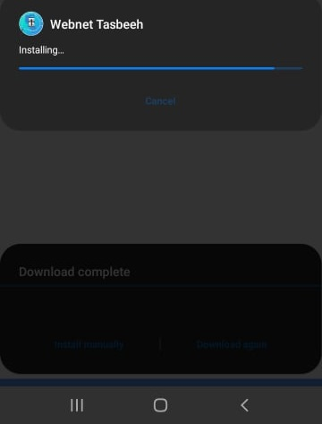

# Cordova-Mobile-Update
Cordova Mobile Auto Update Self 

 

  
  
 remote_server_apk file must be hosted at a server 
 make sure to change url at line 18 in file <a href="https://github.com/MEGAMINDMK/Cordova-Mobile-Update/commit/f0e322e2f4a8f30ed89647bddd489b73d9ec6b56#diff-86661b638645809ed6c062876f3698c84bc5ecffa7fc25c8dbfcee305eee875e">here</a>
